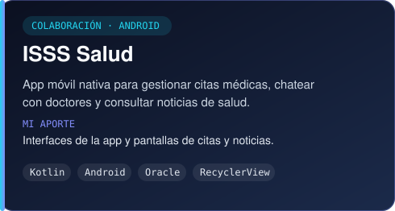

  

  
  
  

## Perfil

Desarrollador de software con experiencia en el ciclo completo de un producto: desde el diseño de la interfaz hasta la lógica de negocio en producción. Trabajo con **C# / .NET**, **Kotlin (Android)** y el stack **MERN**, con foco en software mantenible y centrado en el usuario.

## Trabajo actual

- **Famolcas S.A. de C.V. (Lido)** — módulos ERP y sistemas POS en C# / XAF, y aplicaciones móviles nativas en Kotlin con APIs REST.
- **Formación** — Técnico en Desarrollo de Software en la UCA y Bootcamp Full Stack AI en Kodigo, en paralelo.

## Experiencia

### Programador · Famolcas S.A. de C.V. (Lido)
   

- Desarrollo de módulos ERP escalables con C# y XAF.
- Participación técnica en sistemas POS.
- Aplicaciones móviles nativas en Kotlin con integración de APIs REST.

### Desarrollador Full Stack · Marquesa
    

- Arquitectura frontend y backend con el stack MERN.
- Sistema de chat en tiempo real con WebSockets.
- Diseño de interfaces con enfoque en la experiencia de usuario.

### Practicante de Desarrollo de Software · MOPT
    

- Módulos administrativos institucionales en C# / ASP.NET.
- Prototipos en Figma y pruebas de calidad (QA).
- Despliegue de aplicaciones en servidores IIS.

## Proyectos destacados

Colaboraciones en equipo y proyectos propios.

  
  

  
  

  <a href="https://marquesa.vercel.app"><b>Ver Marquesa en línea</b></a>
  &nbsp;·&nbsp;
  <a href="https://github.com/Xx-pocasangre-xX/ISSS_Salud-Java"><b>ISSS Salud (versión Java)</b></a>
  &nbsp;·&nbsp;
  <a href="https://github.com/Xx-pocasangre-xX?tab=repositories"><b>Todos los repositorios</b></a>

## Stack

  
  
  
  
  
  
  
  
  
  
  
  
  
  
  
  
  

## Educación

- **Técnico en Desarrollo de Software** — Universidad Centroamericana José Simeón Cañas (UCA), en curso
- **Bootcamp Full Stack AI Jr** — Academia Kodigo, en curso
- **Bachillerato Técnico en Desarrollo de Software** — Instituto Técnico Ricaldone, graduado en 2025

## Contacto

Actualmente me encuentro laborando, por lo que solo puedo colaborar en proyectos de forma **remota**. Si tienes una propuesta, escríbeme a [danielpocasangre2006@gmail.com](mailto:danielpocasangre2006@gmail.com) o visita mi [portafolio](https://portafolio-ricardopocasangre.vercel.app).
